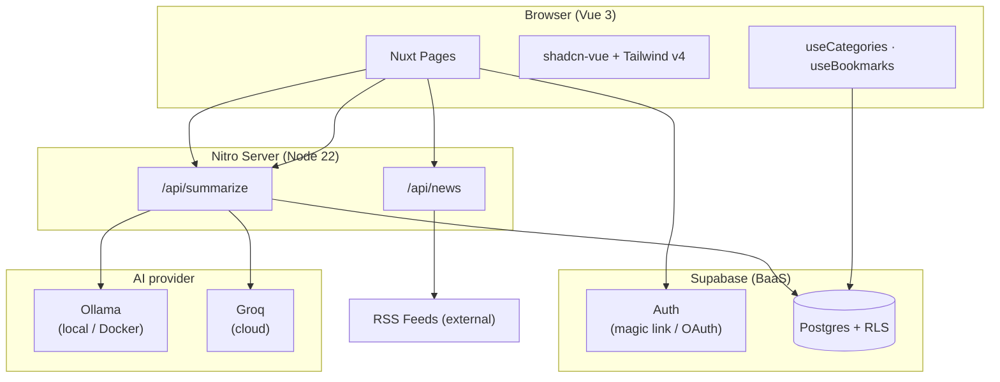
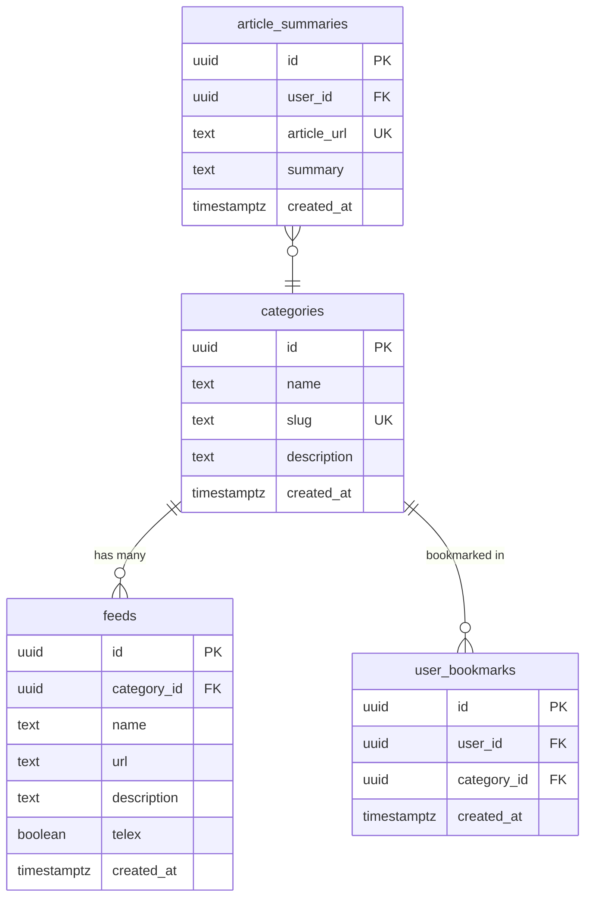
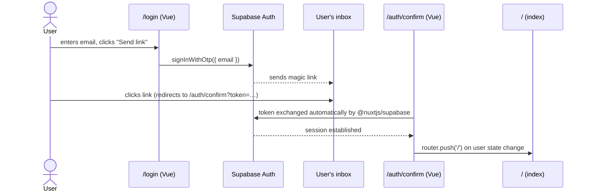
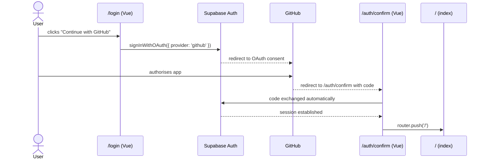
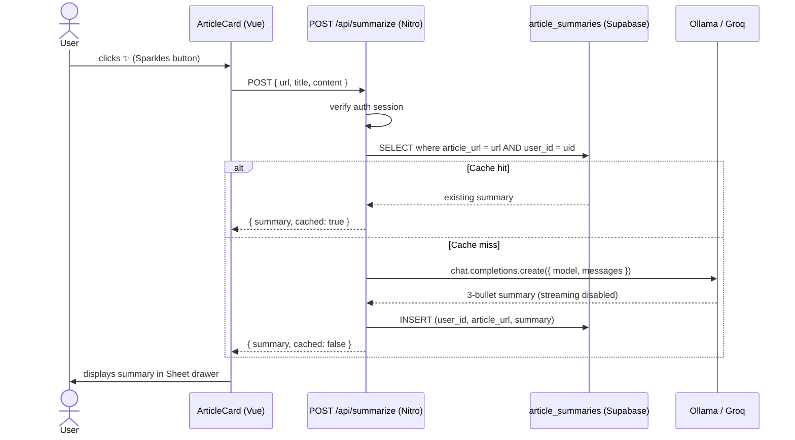
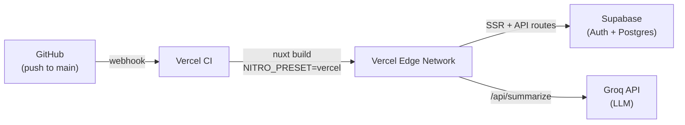
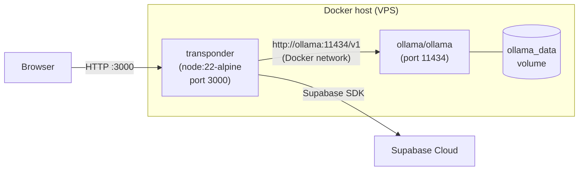

# Transponder — Architecture

## Table of contents

1. [System overview](#1-system-overview)
2. [Database schema](#2-database-schema)
3. [Auth flow](#3-auth-flow)
4. [AI summary flow](#4-ai-summary-flow)
5. [Deployment topology](#5-deployment-topology)

---

## 1. System overview



### Key design decisions

| Decision | Choice | Reason |
|----------|--------|--------|
| SSR framework | Nuxt 4 | File-based routing, Nitro for API routes, Vue 3 ecosystem |
| Auth | Supabase Auth | Zero-config magic link + GitHub OAuth, integrates with Postgres RLS |
| UI library | shadcn-vue (new-york) | Accessible, unstyled by default, Tailwind v4 compatible |
| AI layer | openai SDK + configurable base URL | Provider-agnostic: Ollama locally, Groq in prod |
| Data persistence | Supabase Postgres | Single source of truth for feeds, bookmarks, and AI cache |
| Containerisation | Docker multi-stage | Small image (~170 MB), non-root user, secrets injected at runtime |

---

## 2. Database schema



### Row Level Security policies

| Table | Policy | Rule |
|-------|--------|------|
| `categories` | Public read | `SELECT` — `true` |
| `feeds` | Public read | `SELECT` — `true` |
| `user_bookmarks` | Owner read/write | `user_id = auth.uid()` |
| `article_summaries` | Owner read/write | `user_id = auth.uid()` |

All writes (`INSERT`, `UPDATE`, `DELETE`) on `user_bookmarks` and `article_summaries` require an authenticated session.

---

## 3. Auth flow

### Magic link



### GitHub OAuth



---

## 4. AI summary flow



The API endpoint reads `NUXT_OPENAI_BASE_URL`, `NUXT_OPENAI_API_KEY`, and `NUXT_AI_MODEL` from `runtimeConfig`, making it fully provider-agnostic.

---

## 5. Deployment topology

### Path A — Vercel (serverless)



| Config | Value |
|--------|-------|
| Build command | `npm run build` (Vercel auto-detects) |
| Output directory | `.vercel/output` (Nitro vercel preset) |
| Node version | 22.x |
| `NITRO_PRESET` | Injected automatically by Vercel |

Env vars to add in Vercel dashboard: all 6 variables from `.env.example`, with Groq values for the AI ones.

---

### Path B — Docker (self-hosted / VPS)



| Stage | Base image | Purpose |
|-------|-----------|---------|
| `builder` | `node:22-alpine` | Install deps, `npm run build` |
| `runner` | `node:22-alpine` | Copy `.output/`, run as non-root |

Image size target: ~170 MB. The `.output` directory is fully self-contained (no `node_modules` needed at runtime).

```bash
# Single container
docker build -t transponder .
docker run -p 3000:3000 --env-file .env transponder

# Full stack with Ollama
docker compose up -d
docker compose exec ollama ollama pull llama3.2:3b
```
