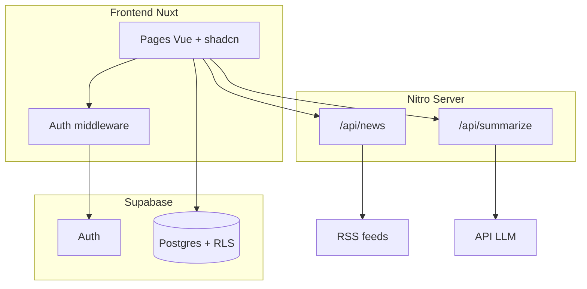

# Orbit News v3 — Roadmap

Reader RSS personnel avec auth, curation de sources et résumés IA.

**Pitch vitrine :**
> Reader RSS personnel full-stack : auth Supabase, curation par utilisateur, parsing RSS edge-side, résumés IA à la demande.

**Utilisateurs cibles :**
1. Usage personnel quotidien
2. Visiteurs de la vitrine (demo limitée ou accès sur invitation)

---

## Stack recommandée

Avec **Vue + Shadcn**, la combinaison la plus cohérente en 2026 :

| Couche | Choix | Pourquoi |
|--------|-------|----------|
| Framework | **Nuxt 4** | Vue 3, routing, SSR, API serveur intégrée |
| UI | **shadcn-vue** + **Tailwind v4** | Shadcn natif Vue, composants copiables/customisables |
| Auth + DB | **Supabase** (`@nuxtjs/supabase`) | Auth, Postgres, RLS — idéal side project |
| RSS | **rss-parser** (API Nitro) | Parsing côté serveur, pas de CORS |
| IA | **OpenAI / Anthropic / Mistral** via route serveur | Clés API jamais exposées au client |
| Déploiement | **Vercel** ou **Netlify** | Zero-config avec Nuxt |
| Repo | **`fomo-v3/`** (nouveau dossier) | Repartir propre, garder v2 en archive |

### Pourquoi Nuxt plutôt qu'autre chose ?

- **Vite + Vue SPA seul** : pas de SSR (moins bon pour la vitrine), API RSS à héberger à part.
- **Astro + Vue** : excellent pour un site vitrine statique, moins adapté à une app interactive avec auth.
- **Quasar / Vuetify** : pas Shadcn, écosystème différent.
- **Next + shadcn** : préférence Vue — inutile de changer.

**Verdict : Nuxt 4 + shadcn-vue + Supabase** — écosystème Vue préféré, stack portfolio crédible et maintenable.

---

## Architecture cible



---

## Phases du projet

### Phase 0 — Setup (½ journée)

**Objectif :** repo vide qui tourne avec la stack complète.

**Tâches :**
- [ ] Créer `fomo-v3/` : `npm create nuxt@latest fomo-v3`
- [ ] Choisir TypeScript, structure `app/` (Nuxt 4)
- [ ] Installer Tailwind v4 + `shadcn-nuxt` ([doc officielle](https://www.shadcn-vue.com/docs/installation/nuxt))
- [ ] `npx shadcn-vue@latest init` puis ajouter composants de base : `button`, `card`, `input`, `sheet`, `sidebar`, `skeleton`, `badge`, `dropdown-menu`, `avatar`, `separator`, `scroll-area`
- [ ] Installer `@nuxtjs/supabase`
- [ ] Créer `.env` + `.env.example` :
  ```env
  NUXT_PUBLIC_SUPABASE_URL=
  NUXT_PUBLIC_SUPABASE_KEY=
  SUPABASE_SERVICE_ROLE_KEY=     # serveur uniquement, jamais côté client
  OPENAI_API_KEY=                # ou autre provider
  ```
- [ ] Configurer ESLint + Prettier (optionnel mais utile vitrine)
- [ ] Premier commit + repo GitHub

**Livrable :** `npm run dev` → page d'accueil avec un bouton shadcn qui fonctionne.

---

### Phase 1 — Supabase & schéma (1 journée)

**Objectif :** base de données prête avec RLS.

**Tables :**

```sql
-- Catalogue public (lecture pour tous)
categories (id, name, description, slug, created_at)
feeds      (id, category_id, name, url, description, telex, created_at)

-- Données utilisateur (RLS strict)
user_bookmarks     (user_id, category_id, created_at)
user_feed_prefs    (user_id, feed_id, created_at)   -- optionnel phase 2
user_custom_feeds  (id, user_id, name, url, created_at)  -- phase 3
article_summaries  (id, user_id, article_url, summary, created_at)  -- cache IA
```

**Politiques RLS :**
- `categories`, `feeds` → `SELECT` public
- `user_*` → accès uniquement si `auth.uid() = user_id`

**Seed data :**
- Reprendre les 20 catégories de `fomo-v2/components/categories.csv`
- 3–5 flux RSS par catégorie prioritaire (Tech, Gaming, World News, Dev, Finance)
- Exporter le SQL de `fomo-v2/supabase/schema.sql` comme base

**Tâches :**
- [ ] Créer projet Supabase
- [ ] Écrire `supabase/migrations/001_initial.sql`
- [ ] Écrire `supabase/seed.sql`
- [ ] Tester les requêtes dans le SQL Editor
- [ ] Brancher `@nuxtjs/supabase` dans `nuxt.config.ts`

**Livrable :** composable `useCategories()` qui retourne catégories + feeds depuis Supabase.

---

### Phase 2 — Auth (1 journée)

**Objectif :** login fonctionnel, routes protégées.

**Méthodes auth recommandées :**
1. **Magic link email** — simple, pro pour une vitrine
2. **OAuth GitHub** — très "dev portfolio"
3. Les deux

**Pages :**
- `/login` — formulaire shadcn (email ou boutons OAuth)
- `/auth/callback` — géré par Supabase
- Middleware `auth` sur les routes privées

**Tâches :**
- [ ] Configurer Auth dans Supabase Dashboard (redirect URLs : `localhost:3000`, domaine prod)
- [ ] Page login avec shadcn (`Card`, `Input`, `Button`)
- [ ] `middleware/auth.ts` — redirect si non connecté
- [ ] Composable `useUser()` / utiliser `useSupabaseUser()`
- [ ] Header avec avatar + menu déconnexion
- [ ] Migrer bookmarks : localStorage → `user_bookmarks` (composable `useBookmarks()`)

**Livrable :** utilisateur connecté voit ses bookmarks persistés en base, même après changement d'appareil.

---

### Phase 3 — Core UI reader (2–3 jours)

**Objectif :** l'app utilisable au quotidien, UI soignée shadcn.

**Layout (inspiré v2, refait proprement) :**

```
┌─────────────────────────────────────────────────┐
│ Header : logo | search? | avatar                │
├──────────┬──────────────┬───────────────────────┤
│ Sidebar  │ Sources      │ Articles              │
│          │              │                       │
│ Bookmarks│ Flux RSS de  │ Liste d'articles      │
│ Categories│ la catégorie │ (ArticleCard shadcn)  │
└──────────┴──────────────┴───────────────────────┘
```

**Composants à créer :**
- `AppSidebar.vue` — shadcn Sidebar
- `CategoryList.vue` — bookmarks + catégories
- `FeedList.vue` — sources d'une catégorie
- `ArticleList.vue` — liste articles
- `ArticleCard.vue` — titre, snippet, date, actions (ouvrir, partager, résumer)
- `WelcomeEmpty.vue` — état vide

**API :**
- [ ] `server/api/news.get.ts` — reprendre la logique v2 (`rss-parser`)
- [ ] Gestion erreurs : flux mort, timeout, XML invalide
- [ ] Skeleton loaders pendant le chargement

**Tâches :**
- [ ] Page `/` (dashboard reader) — layout 3 colonnes desktop, drawer mobile
- [ ] Toggle bookmark catégorie (étoile / icône)
- [ ] Sélection catégorie → source → articles
- [ ] Responsive mobile (Sheet ou Sidebar collapsible)
- [ ] Dark mode (shadcn le gère bien via Tailwind)

**Livrable :** lecture des flux RSS avec UI propre, bookmarks en base.

---

### Phase 4 — Feature IA (1–2 jours)

**Objectif :** le différenciateur portfolio.

**MVP IA (choisir 1 pour commencer) :**

| Feature | Complexité | Impact vitrine |
|---------|------------|----------------|
| **Résumé article** (bouton sur chaque article) | Faible | Fort |
| Digest quotidien (10 titres + résumé) | Moyenne | Très fort |
| "Pourquoi ça m'intéresse" (personnalisé) | Élevée | Phase ultérieure |

**Recommandation MVP :** bouton **"Résumer"** sur chaque article.

**Flow :**
1. Clic "Résumer" → `POST /api/summarize` avec `{ url, title, contentSnippet }`
2. Serveur appelle le LLM avec prompt structuré
3. Cache en `article_summaries` (éviter re-appels)
4. Affichage dans un `Sheet` ou `Dialog` shadcn

**Tâches :**
- [ ] `server/api/summarize.post.ts`
- [ ] Prompt : 3 bullet points + 1 phrase "pourquoi c'est important"
- [ ] Table cache `article_summaries`
- [ ] Rate limiting basique (ex. 20 req/jour/user côté serveur)
- [ ] État loading + erreur dans l'UI

**Livrable :** feature IA démo-able en 30 secondes sur la vitrine.

---

### Phase 5 — Polish & vitrine (1–2 jours)

**Objectif :** prêt à montrer publiquement.

**Pages publiques :**
- `/` — reader (auth requise, ou mode demo)
- `/about` ou section landing — "Qu'est-ce qu'Orbit News ?" (optionnel si intégré à la vitrine externe)

**Intégration site vitrine :**
- [ ] Carte projet sur le site perso : screenshot, stack badges, lien "Voir la demo"
- [ ] README GitHub soigné : screenshots, stack, features, setup local
- [ ] Variables d'env documentées
- [ ] Favicon + meta OG (Nuxt `useSeoMeta`)

**Qualité :**
- [ ] Page 404 custom
- [ ] États vides (pas de bookmarks, pas de flux, erreur RSS)
- [ ] Accessibilité basique (focus, labels)
- [ ] Performance : lazy load articles, pas de re-fetch inutile

**Déploiement :**
- [ ] Vercel : connect repo, env vars Supabase + LLM
- [ ] Supabase : ajouter URL prod dans Auth redirect URLs
- [ ] Domaine : `orbit.tondomaine.com` ou sous-path

**Livrable :** URL publique fonctionnelle, linkable depuis la vitrine.

---

### Phase 6 — Extensions (post-MVP, optionnel)

À faire seulement quand le MVP tourne :

- [ ] Feeds custom par utilisateur (`user_custom_feeds`)
- [ ] Digest email quotidien (Supabase Edge Function + Resend)
- [ ] Recherche full-text dans les articles récents
- [ ] Mode "telex" (contenu complet inline)
- [ ] PWA (installable sur mobile)
- [ ] Import OPML (exporter depuis Feedly/Inoreader)
- [ ] Partage de collections publiques ("ma liste tech")

---

## Structure de dossiers suggérée

```
fomo-v3/
├── app/
│   ├── assets/css/tailwind.css
│   ├── components/
│   │   ├── ui/              # shadcn (auto-généré)
│   │   ├── layout/
│   │   │   ├── AppHeader.vue
│   │   │   └── AppSidebar.vue
│   │   └── reader/
│   │       ├── CategoryList.vue
│   │       ├── FeedList.vue
│   │       ├── ArticleCard.vue
│   │       └── SummarySheet.vue
│   ├── composables/
│   │   ├── useCategories.ts
│   │   ├── useBookmarks.ts
│   │   └── useArticles.ts
│   ├── middleware/
│   │   └── auth.ts
│   ├── pages/
│   │   ├── index.vue
│   │   └── login.vue
│   └── app.vue
├── server/
│   └── api/
│       ├── news.get.ts
│       └── summarize.post.ts
├── supabase/
│   ├── migrations/
│   └── seed.sql
├── .env.example
├── nuxt.config.ts
└── README.md
```

---

## Ordre de travail recommandé

```
Semaine 1
├── J1  Phase 0 : scaffold Nuxt + shadcn + Supabase module
├── J2  Phase 1 : schéma DB + seed + composable categories
├── J3  Phase 2 : auth + bookmarks en base
├── J4–J5  Phase 3 : UI reader complète

Semaine 2
├── J1  Phase 4 : résumé IA
├── J2  Phase 5 : polish + déploiement + README
└── J3+ Phase 6 : extensions si envie
```

**Estimation totale MVP vitrine : 5–8 jours** à temps partiel.

---

## Ce qu'on garde / jette de v2

| Garder (logique) | Jeter (code) |
|------------------|--------------|
| Concept 3 colonnes | Vuetify + plugin Supabase maison |
| `categories.csv` comme seed | Composants morts (`settings`, `feed`, etc.) |
| API RSS Nitro | Clés hardcodées |
| Idée bookmarks | localStorage comme source de vérité |
| Nom "Orbit News" | README template Nuxt |

---

## Risques à anticiper

1. **Flux RSS qui cassent** — prévoir UI d'erreur claire, pas de crash global
2. **Coût LLM** — cache obligatoire + rate limit
3. **shadcn + Nuxt 4** — suivre la [doc shadcn-vue Nuxt](https://www.shadcn-vue.com/docs/installation/nuxt) ; mettre `assets` dans `app/` si alias cassés
4. **CORS RSS** — toujours parser côté Nitro, jamais côté client
5. **Scope creep** — ne pas toucher Phase 6 avant d'avoir Phase 5 en prod

---

## Prochaine étape

Démarrer **Phase 0** : scaffold Nuxt 4 + shadcn-vue + Supabase avec la structure ci-dessus, le schéma SQL et les premiers composants.
